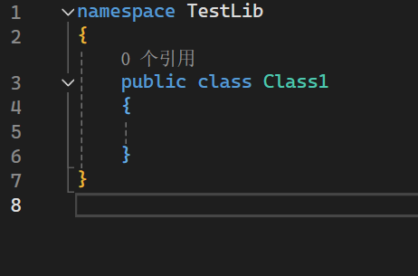
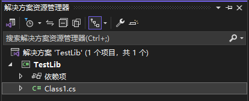
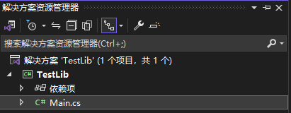
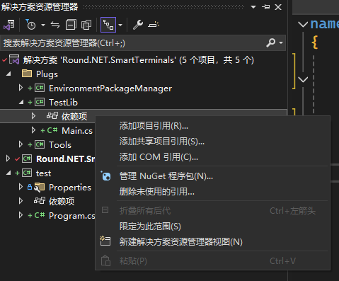
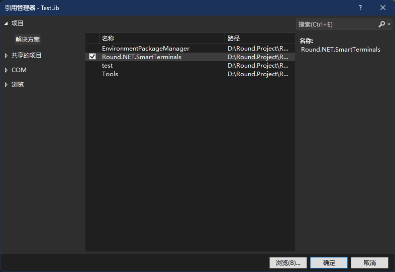

# 引入项目

## 引入 RST 的接口
恭喜你学会了创建项目，接下来我们需要引入 RST 的接口。  

:::warning 提示 
请务必确保.NET类库的.NET版本在 6.0 及以上，否则可能导致运行时错误。
:::

### 1. 初始化库

  
这是我们新建库时自带的代码，类的名字叫Class1

``` C
namespace TestLib
{
    public class Class1
    {

    }
}
```  
随后，在 Main 类中添加一个方法  
``` C
public static void InitLib(){
    // RST 拓展初始化函数
}
```  
让整个代码文件看起来是这样：  
``` C
namespace TestLib
{
    public class TestLib
    {
        public static void InitLib(){
            // RST 拓展初始化函数
        }
    }
}
```  

接下来，我们要修改成 RST 可读取的样子  

  

> 将这个自带的文件修改成 ```Main.cs```  

  
最后，整个```Main.cs```内的样子：  
``` C
namespace TestLib
{
    public class Main
    {
        public static void InitLib(){
            // RST 拓展初始化函数
        }
    }
}
```
下面，我们要开始引入 RST 的接口。  

### 2. 添加引用
:::danger 注意 
RST 的接口dll文件需要自行下载编译！  
且最好直接下载RST的项目源码，在RST的项目内创建类库！
::: 

同样的，打开解决方案管理器  
:::warning 提示 
此处将默认你是从RST项目中创建的类库
:::

  
右键依赖项，选择添加项目引用  

  
打开引用管理器，选择解决方案中的```Round.NET.SmartTerminals```，然后点击确定。  
就这样，接口就被我们引用进来了。