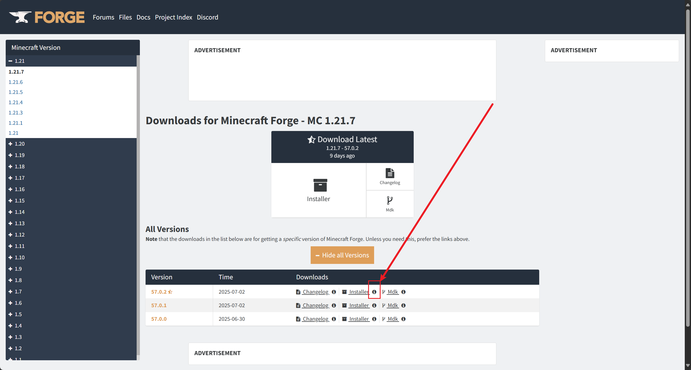
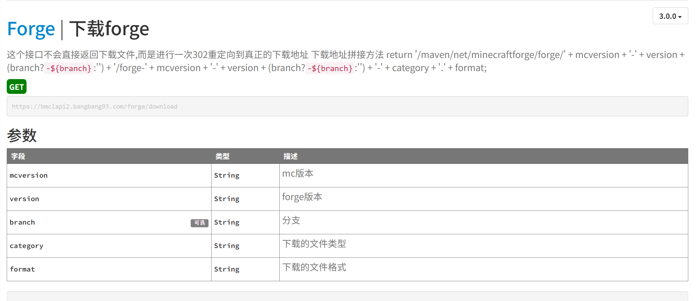
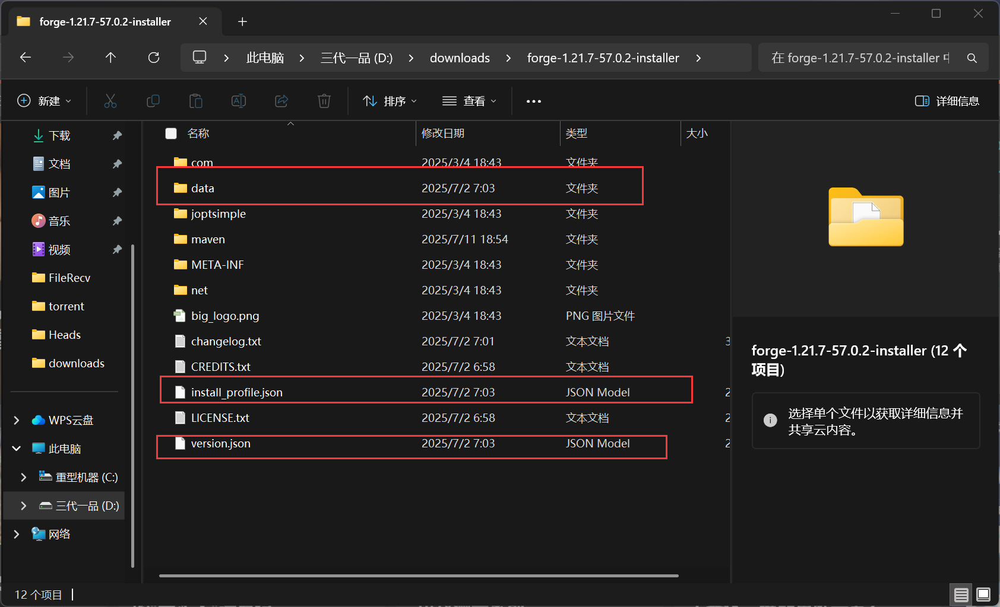
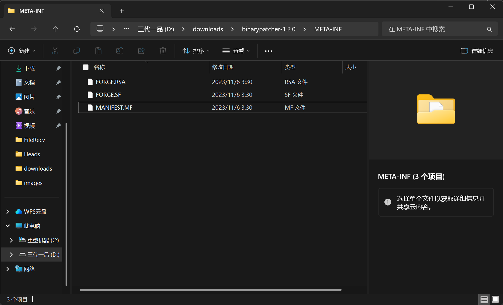

# MC 启动器如何手动安装 Forge？


## 1. 从网上下载 Forge


这一步需要从网上下载 `installer jar` 文件。

首先，我们需要从[ Forge 官网](https://files.minecraftforge.net)上，找到原始 `jar` 的下载路径。

我们可以看看这张图片：



点击这个小按钮，我们即可获取到 `Forge` 的原始 `jar` 文件。

我们也可以看看它拼接的网址：

https://maven.minecraftforge.net/net/minecraftforge/forge/1.21.7-57.0.2/forge-1.21.7-57.0.2-installer.jar

大概是这样的。

这一步我们也可以从 `BMCLAPI` 上获取。



从这上面获取到的 `jar` 路径拼接大概长这样：

https://bmclapi2.bangbang93.com/forge/download?mcversion=1.21.7&version=57.0.2&category=installer&format=jar

好了！我们可以通过启动器的网络请求，将这个 jar 文件下载下来。

## 2. 解压 jar 文件

随后，我们便可以解压它了。

下载完成之后，我们先暂时不要删掉这个 `installer jar` 文件~后面会有大用处~~

通过启动器对我们刚刚下载的 `installer` 解压，随后我们仅需保留以下 3 个`文件/文件夹`



随后，我们便可以进行安装了！首先，我们需要读取里面的 `versions.json` 文件，我们可以看到，这个就是 `Forge` 最根本的 `版本 json` 文件。我们只需要将其放到我们的 `.minecraft/versions/<版本名字>/<版本名字>.json` 即可！

## 3. 下载 libraries 类库

随后，我们先将 `versions.json` 里面的所有 `libraries` 键值的类库全部下载下来。下载到 `.minecraft/libraries` 目录下。

随后，我们再读取一次 `install_profile.json` 这个文件。这个文件需要与 `data` 文件夹保持在同级，稍后你们便可以知道 `data` 里面的东西是什么了~

读取了之后，我们往下滑，找到有一个 `libraries` 键值，这个键值里面的所有类库，我们都需要将其下载到 `.minecraft/libraries` 目录下。

下载好了吗？接下来是最后一步！！

## 4. 运行 processors

### 1. 分析 processors 信息

这一步非常关键，没有这一步，那么 `Forge` 将无法正常运行~

首先，我先截个 `processors` 的代码片段：

``````json
{
    "sides": [
        "server"
    ],
    "jar": "net.minecraftforge:installertools:1.4.3",
    "classpath": [
        "net.sf.jopt-simple:jopt-simple:6.0-alpha-3",
        "com.google.code.gson:gson:2.10.1",
        "de.siegmar:fastcsv:2.2.2",
        "net.minecraftforge:srgutils:0.5.10",
        "org.ow2.asm:asm-commons:9.7",
        "org.ow2.asm:asm-tree:9.7",
        "org.ow2.asm:asm:9.7"
    ],
    "args": [
        "--task",
        "EXTRACT_FILES",
        "--archive",
        "{INSTALLER}",
        "--from",
        "data/README.txt",
        "--to",
        "{ROOT}/README.txt",
        "--from",
        "data/run.sh",
        "--to",
        "{ROOT}/run.sh",
        "--exec",
        "{ROOT}/run.sh",
        "--from",
        "data/run.bat",
        "--to",
        "{ROOT}/run.bat",
        "--from",
        "data/user_jvm_args.txt",
        "--to",
        "{ROOT}/user_jvm_args.txt",
        "--optional",
        "{ROOT}/user_jvm_args.txt",
        "--from",
        "data/unix_args.txt",
        "--to",
        "{ROOT}/libraries/net/minecraftforge/forge/1.21.7-57.0.2/unix_args.txt",
        "--from",
        "data/win_args.txt",
        "--to",
        "{ROOT}/libraries/net/minecraftforge/forge/1.21.7-57.0.2/win_args.txt"
    ]
}
``````

这张图片里面，有运行该 `process` 的所有信息~

我们首先找到第一个字段：`side`，这个字段的意思就是：【运行在服务端】的意思。

如果我们的启动器只安装客户端，那么完全可以忽略掉这个字段所代表的这个 `processors`。

紧接着，我们再看下面一个字段：`jar`，这个字段的意思就是：主 `jar` 的意思。

如果你写过 `MC` 的启动参数的话，你应该知道，这个就相当于是在 `版本 JSON -> download -> client` 键值下面的那个 `jar` 一样，是需要放在 `-cp` 参数的最末尾的。

好了，介绍完了 `jar` 之后，接下来介绍一下 `classpath` 字段。这个字段的意思就是：`-cp` 参数后面跟着的内容。

我前面一直都说过，我们是要【运行】`processors`，因此，我们只需要将该 `-cp` 参数的里面，都填上上述的 `path` 即可！

那么，很多人应该都发现了，上述的 `classpath` 里面只有一个值，应该如何拼接？

很简单，你是怎么拼接 `MC Libraries` 的，这个就怎么拼接，记住，`Root` 目录在你的 `.minecraft/libraries` 下！

介绍完 `classpath` 之后，下面我们再来介绍一下 `args` 字段！首先，最最重要的是，它是我们的【默认 `game` 参数】！

大家应该能看到，里面有一大堆的 `{}` 引用的，我们称之为【字符串模板】的东西，你别问我为什么不用 `${}`，请找 Forge 官方问。

### 2. 替换字符串模板

那么，字符串模板我们替换成什么呢？很简单，我们往上面找。有一个 `data` 键值对。里面就是我们要替换的所有字符串模板啦！

我先贴出来给各位看看：

``````json
{
    "MOJMAPS": {
        "client": "[net.minecraft:client:1.21.7:mappings@tsrg]",
        "server": "[net.minecraft:server:1.21.7:mappings@tsrg]"
    },
    "MOJMAPS_SHA": {
        "client": "'0ec464aa170becd2ae2fa0d319340cd7ff301445'",
        "server": "'5c3e232c4b6829d3637b45d7f5e9b30b19b3e938'"
    },
    "MC_UNPACKED": {
        "client": "[net.minecraft:client:1.21.7]",
        "server": "[net.minecraft:server:1.21.7:unpacked]"
    },
    "MC_UNPACKED_SHA": {
        "client": "'a2db1ea98c37b2d00c83f6867fb8bb581a593e07'",
        "server": "'f77e698164938b4bedf5329fa5a68afa86dafd4e'"
    },
    "MC_OFF": {
        "client": "[net.minecraft:client:1.21.7:official]",
        "server": "[net.minecraft:server:1.21.7:official]"
    },
    "MC_OFF_SHA": {
        "client": "'b84bdd90129c3bbb254aee637d59a8e64b3619bd'",
        "server": "'4010406fd15d64bed124fd0a177f18b3c92cd8e3'"
    },
    "BINPATCH": {
        "client": "/data/client.lzma",
        "server": "/data/server.lzma"
    },
    "PATCHED": {
        "client": "[net.minecraftforge:forge:1.21.7-57.0.2:client]",
        "server": "[net.minecraftforge:forge:1.21.7-57.0.2:server]"
    },
    "PATCHED_SHA": {
        "client": "'2e43df1eec8e47a0bc796c7c5974f25b09dc0223'",
        "server": "'54d6d7bd191d8dc9bc9a4681bd177b857e0aa174'"
    }
}
``````

以上是所有字符串模板的信息，首先是 `data` 里面的字段，所有的键就是模板，然后值的话，里面有 `server` 和 `client` 两个字段，分别代表了服务端和客户端。还是那句老话，如果你要下载服务端的话，请读取 `server` 里的内容，否则请读取 `client` 里的内容！

说完了字符串模板，我们惊讶的发现，我们的 `processors` 里面还有某些键值没有说到，这是怎么回事？

我列了一个表格，各位可以看看：

| 模板名          | 替换值                                                      |
| --------------- | ----------------------------------------------------------- |
| {\{INSTALLER}\}     | installer jar 的所在目录                                    |
| {\{ROOT}\}          | `.minecraft` 文件的所在地                                   |
| {\{MINECRAFT_JAR}\} | `.minecraft/versions/<版本名字>/<版本名字>.jar`文件的所在地 |
| {\{SIDE}\}          | 如果是服务端，`server`，如果是客户端，`client`              |

好的，说完了【字符串模板】，下一个我们应该看看，如果我们往下找的话，其实还有一个键值，那就是 ```output```！

这个键值的意思是：输出的文件 `sha1` 是否满足？

然后字符串模板就在上面的 `data` 键值对下。

请注意，上述的 `data` 键值对，下面的所有 `net.xxx.yyy:zzz:ppp` 啥的这种，`ROOT` 均要装配在 `.minecraft/libraries` 目录下，不要搞错咯~

所以，为什么让各位当初不要删掉 `data` 目录了吧，因为在 `install_profile` 里面确实有很多的地方需要依赖这里面的东西，比如说 `client.lzma`、`server.lzma` 这种文件，都是在 `data` 目录下的。

### 3. 开始运行 processors

那么，接下来就要开始运行我们的 `processors` 了！

我们首先随意看一个 `processors`：

```json
{
    "jar": "net.minecraftforge:binarypatcher:1.2.0",
    "classpath": [
        "net.minecraftforge:srgutils:0.5.6",
        "net.sf.jopt-simple:jopt-simple:6.0-alpha-3",
        "com.github.jponge:lzma-java:1.3",
        "com.nothome:javaxdelta:2.0.1",
        "trove:trove:1.0.2"
    ],
    "args": [
        "--clean",
        "{MC_OFF}",
        "--output",
        "{PATCHED}",
        "--apply",
        "{BINPATCH}",
        "--data",
        "--unpatched"
    ],
    "outputs": {
        "{PATCHED}": "{PATCHED_SHA}"
    }
}
```

那么，这个 `processors` 里面有啥呢？有 `classpath`，有 `args`，但是好像还缺了点什么，哦对了！缺主类！！

相信看过我前面几期教程的人，应该都能明白，所有主类之前的参数，都叫 `jvm` 参数，所有主类之后的参数，都叫 `game` 参数！

`JVM` 参数的话，这里没有写，那么肯定就默认啦~可以加一点类似于 `-Xmx1024m -Xmn256m` 这样的一些默认的 `JVM` 参数！

那么，主类我们应该从哪获取呢？我们首先，得先解压一次 `jar` 键下的那个 `jar` 文件。

通过我们的寻找，我们发现，我们其实很早就已经把里面的 `jar` 给下载下来了！其中，上述的 `binarypatcher`，我们在下面的 `libraries` 中，已经能够看见被下载下来了！

```json
{
    "name": "net.minecraftforge:binarypatcher:1.2.0",
    "downloads": {
        "artifact": {
            "path": "net/minecraftforge/binarypatcher/1.2.0/binarypatcher-1.2.0.jar",
            "url": "https://maven.minecraftforge.net/net/minecraftforge/binarypatcher/1.2.0/binarypatcher-1.2.0.jar",
            "sha1": "e5fea8a667a3ebff4e94fb74467c99c02914e4bc",
            "size": 27514
        }
    }
}
```

既然已经被下载下来了，那么，我们解压里面的内容，我们大概可以从这个目录下找到主类：



这里面，我框出来的那个，就是主类所在的文件了~我们用【字符串流】读取这个文本内容。我们可以发现如下信息：

````
Manifest-Version: 1.0
Implementation-Title: net.minecraftforge:BinaryPatcher
Implementation-Version: 1.2.0
Specification-Vendor: Forge Development LLC
Specification-Title: Binary Patcher
Specification-Version: 1.2
Main-Class: net.minecraftforge.binarypatcher.ConsoleTool
Implementation-Vendor: Forge Development LLC

Name: net/minecraftforge/binarypatcher/Generator$1.class
SHA-256-Digest: kEoK2AnXXsCrWautKfqVndHpcizGGWwjbqa2zh1ukdA=

Name: net/minecraftforge/binarypatcher/Patcher.class
SHA-256-Digest: j66I6f5hQBqQGaOJAqPkMemsLzihJRaKHDzj1f+cRbc=

Name: net/minecraftforge/binarypatcher/Generator.class
SHA-256-Digest: albsBZcXlnDqnPHxIsTAQKF0LgOON6gpij8DyaUp0mk=

Name: net/minecraftforge/binarypatcher/Generator$PatchSet.class
SHA-256-Digest: 6NHsC2WYkInuNNctsBDOouRonxy53tJICpehqp2iWyI=

Name: net/minecraftforge/binarypatcher/Util.class
SHA-256-Digest: avP9try65w8vPSYWspZickRvNyCFYE+sRSrry1YAGWA=

Name: net/minecraftforge/binarypatcher/ConsoleTool.class
SHA-256-Digest: O6zznaqfFI/qM+Cd8MPV1ZNdQHNUY3VhLPlSmmFWdQU=

Name: net/minecraftforge/binarypatcher/Patch.class
SHA-256-Digest: t+7YpTM6e1RHgohaWmiX18GdMx/XKLHopjWJKqi1mRk=
````

我们发现，其中有一个字段名字叫 `Main-Class`，那么这个冒号后面的，就是我们需要找的主类啦！！

于是，我们可以拼接出最终需要运行的 `processors` 字段！

```
java -cp ".minecraft/libraries/net/minecraftforge/srgutils/0.5.6/srgutils-0.5.6.jar;.minecraft/libraries/net/sf/jopt-simple/jopt-simple/6.0-alpha-3/jopt-simple-6.0-alpha-3.jar;.minecraft/libraries/com/github/jponge/lzma-java/1.3/lzma-java-1.3.jar;.minecraft/libraries/com/nothome/javaxdelta/2.0.1/javaxdelta-2.0.1.jar;.minecraft/libraries/trove/trove/1.0.2/trove-1.0.2.jar;.minecraft/libraries/net/minecraftforge/binarypatcher/1.2.0/binarypatcher-1.2.0.jar" net.minecraftforge.binarypatcher.ConsoleTool --clean ".minecraft/libraries/net/minecraft/libraries/client/1.21.7/client-1.21.7-official.jar" --output ".minecraft/libraries/net/minecraftforge/forge/1.21.7-57.0.2/forge-1.21.7-57.0.2-client.jar" --apply "./data/client.lzma" --data --unpatched
```

此时，我们只需要静静等待，等待它运行完毕，随后在 `.minecraft/libraries/net/minecraftforge/forge/1.21.7-57.0.2/forge-1.21.7-57.0.2-client.jar` 位置生成一个 `PATCHED` 补丁。然后，我们就可以检查它的 `sha1` 是否正确啦！

随后，我们只需要遍历一次这个 `processors` 然后找到运行所有的 `processor` 即可成功安装 `Forge`！

